# Rozdělování pomocníků — návod krok za krokem

Tento návod vás provede celým postupem: od nahrání odpovědí pomocníků až po
hotovou tabulku v Excelu. Je psaný jednoduše a každý krok má obrázek.

**Jak číst obrázky.** Na obrázcích je **červeným rámečkem** označeno, na co
máte kliknout nebo na co se máte podívat. Je-li rámečků víc, mají **čísla** —
ta odpovídají číslům v textu pod obrázkem.

> Všechna jména, e-maily a telefony na obrázcích jsou **vymyšlená**. Žádný
> obrázek nepochází ze skutečných dat.

## Obsah

1. [Než začnete](#1-než-začnete)
2. [Jak vypadá aplikace](#2-jak-vypadá-aplikace)
3. [Krok 1: Nahrajte pomocníky](#3-krok-1-nahrajte-pomocníky)
4. [Krok 2: Přiřaďte jména kamarádů](#4-krok-2-přiřaďte-jména-kamarádů)
5. [Krok 3: Nahrajte organizátory](#5-krok-3-nahrajte-organizátory)
6. [Krok 4: Nastavte budovy a místnosti](#6-krok-4-nastavte-budovy-a-místnosti)
7. [Krok 5: Štítky, skupinky a parametry (nepovinné)](#7-krok-5-štítky-skupinky-a-parametry-nepovinné)
8. [Krok 6: Sestavte rozdělení](#8-krok-6-sestavte-rozdělení)
9. [Krok 7: Upravte rozdělení ručně](#9-krok-7-upravte-rozdělení-ručně)
10. [Krok 8: Uložte verzi a exportujte do Excelu](#10-krok-8-uložte-verzi-a-exportujte-do-excelu)
11. [Když něco nejde](#11-když-něco-nejde)

---

## 1. Než začnete

Připravte si:

- **Odpovědi pomocníků** — soubor `.xlsx` s odpověďmi z Google Formuláře,
  stažený jako Excel. Nic v něm neupravujte.
- **Odpovědi organizátorů** — stejně stažený soubor `.xlsx` z formuláře pro
  organizátory. Je nepovinný.

Program spustíte tak, že rozbalíte stažený archiv a dvakrát kliknete na
`rostering.exe`. **Okno programu nechte otevřené** — když ho zavřete, aplikace
přestane fungovat. Prohlížeč se otevře sám na adrese
<http://127.0.0.1:8000>. (Podrobnosti o stažení jsou v [README](../../README.md).)

Vše, co uděláte, se **ukládá samo**. Nemusíte nic ukládat na konci práce.

## 2. Jak vypadá aplikace

Nahoře je **šest záložek**. Jdou za sebou tak, jak se pracuje:

| Záložka | K čemu slouží |
|---|---|
| **1. Lidé** | pomocníci a organizátoři |
| **2. Štítky** | označování lidí (nepovinné) |
| **3. Vynucené skupinky kamarádů** | kdo musí být spolu (nepovinné) |
| **4. Budovy** | budovy, místnosti a počty lidí |
| **5. Parametry rozřazování** | jak moc počítač váží přání (nepovinné) |
| **6. Rozdělení pomocníků** | výsledek, ruční úpravy a export |

Vlevo je **postranní panel**. Otevřete ho nebo zavřete tlačítkem ☰ vlevo nahoře.

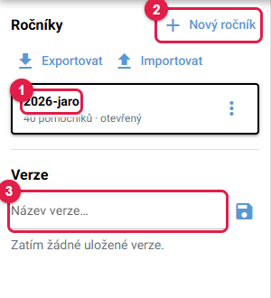

1. **Ročník** — jedna soutěž (například `2026-jaro`). Každý ročník má svá
   vlastní data. Přepínat se mezi ročníky dá tlačítkem *Otevřít* u ročníku.
2. **Nový ročník** — založí prázdný ročník.
3. **Verze** — pojmenované „zálohy“ rozdělení. Viz [krok 8](#10-krok-8-uložte-verzi-a-exportujte-do-excelu).

Vpravo nahoře je ikona se zaškrtávátky. Otevře panel **K vyřízení**: seznam
všeho, co čeká na vaše rozhodnutí. Číslo na ikoně říká, kolik toho je.
Když je číslo nenulové, stojí za to se tam podívat.

## 3. Krok 1: Nahrajte pomocníky

Na záložce **1. Lidé** je prázdná aplikace. Klikněte na **Načíst pomocníky**
a vyberte soubor s odpověďmi.

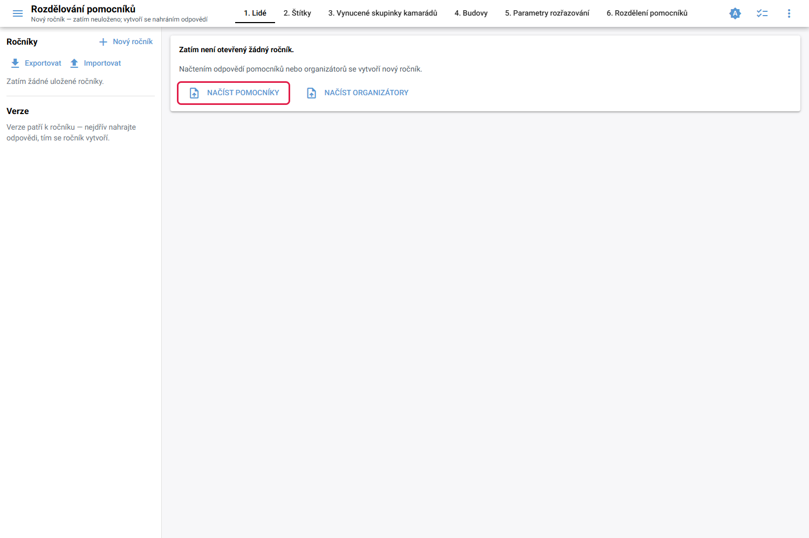

Aplikace se zeptá na **označení ročníku**. Bývá už vyplněné podle data
odpovědí. Tvar je *rok-jaro* nebo *rok-podzim*, například `2026-jaro`.
Pokud sedí, klikněte na **Vytvořit ročník a načíst odpovědi**.

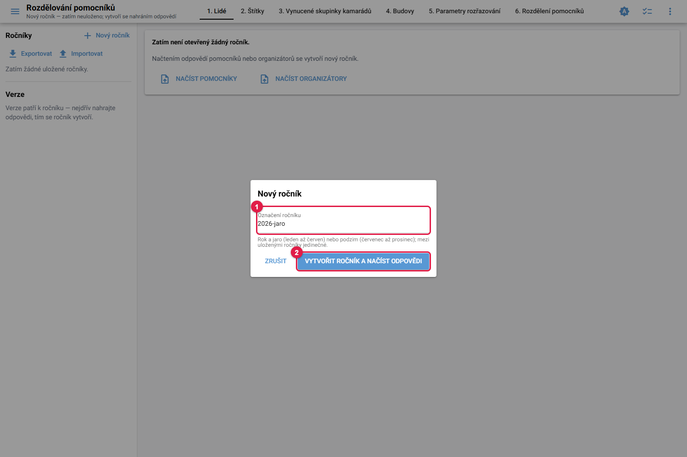

1. Označení ročníku.
2. Tlačítko, které ročník vytvoří a načte odpovědi.

Hotovo — v tabulce **Pomocníci** vidíte všechny, kdo se přihlásili. U každého
je vidět, v jakých budovách chce pomáhat, jaké může přinést vybavení (notebook,
fotoaparát), velikost trička a kolik kamarádů uvedl.

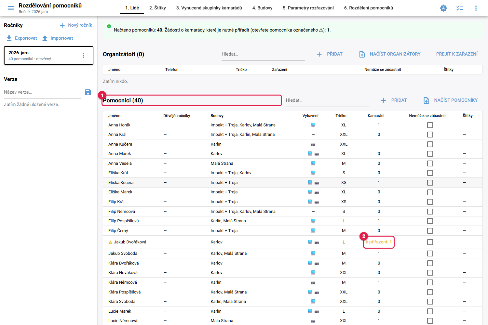

1. Tabulka **Pomocníci** se jménem a počtem načtených lidí.
2. Oranžové **k přiřazení** — viz další krok.

Dobré vědět:

- Kdo se nakonec **nemůže zúčastnit**, tomu zaškrtněte políčko
  *Nemůže se zúčastnit* v jeho řádku. Do rozdělení se pak nedostane.
- Přihlásil se někdo pozdě? Klikněte na **Přidat** nad tabulkou a zadejte
  ho ručně (jméno a kontakt). Ukážeme to v [kroku 7](#9-krok-7-upravte-rozdělení-ručně).
- Přišly nové odpovědi? Klikněte znovu na **Načíst pomocníky** a vyberte
  novější soubor. Nic se tím nesmaže — aplikace jen doplní nové lidi
  a v panelu **K vyřízení** ukáže, co se změnilo.

## 4. Krok 2: Přiřaďte jména kamarádů

Pomocníci píší jména kamarádů volným textem („Terka“, „Kolega z fakulty“).
Aplikace většinu jmen pozná sama. Na ta, která nepozná, se zeptá.

Poznáte je podle ⚠ u jména a oranžového textu **k přiřazení** ve sloupci
*Kamarádi*. Klikněte na něj.

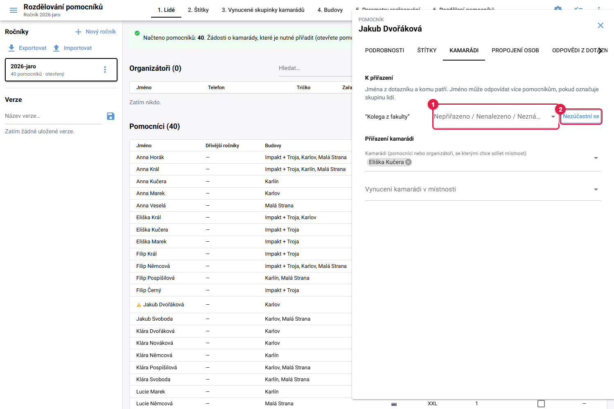

Otevře se okno pomocníka na kartě **Kamarádi**. V části **K přiřazení** uvidíte
napsané jméno v uvozovkách.

1. Ze seznamu vyberte správného člověka. Je-li jméno nesmysl nebo neznámé,
   nechte ho tak, jak je.
2. Je-li to člověk, který se soutěže **nezúčastní**, klikněte na
   **Nezúčastní se**. Přání se pak nebude brát v úvahu.

Okno zavřete křížkem vpravo nahoře. Změny se ukládají samy.

## 5. Krok 3: Nahrajte organizátory

Organizátoři se nahrávají stejně jako pomocníci: na záložce **1. Lidé** klikněte
na **Načíst organizátory** a vyberte jejich soubor. Ročník už existuje, takže
se na označení nikdo neptá.

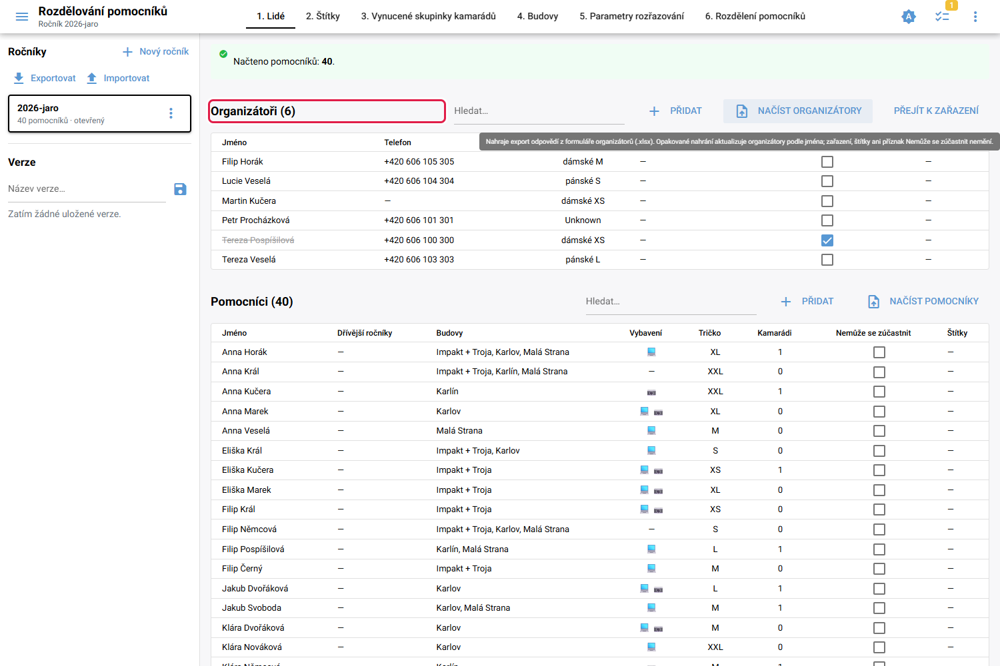

Nad tabulkou **Pomocníci** přibude tabulka **Organizátoři** (jejich počet je v nadpisu).
Organizátor, který nepřijde, má jméno přeškrtnuté a zaškrtnuté políčko
*Nemůže se zúčastnit*.

Organizátoři **nejsou** rozdělováni počítačem. Na místa vedoucích je
postavíte ručně v [kroku 7](#9-krok-7-upravte-rozdělení-ručně).

## 6. Krok 4: Nastavte budovy a místnosti

Počítač potřebuje vědět, **kde se pomáhá a kolik lidí je třeba**. Otevřete
záložku **4. Budovy**.

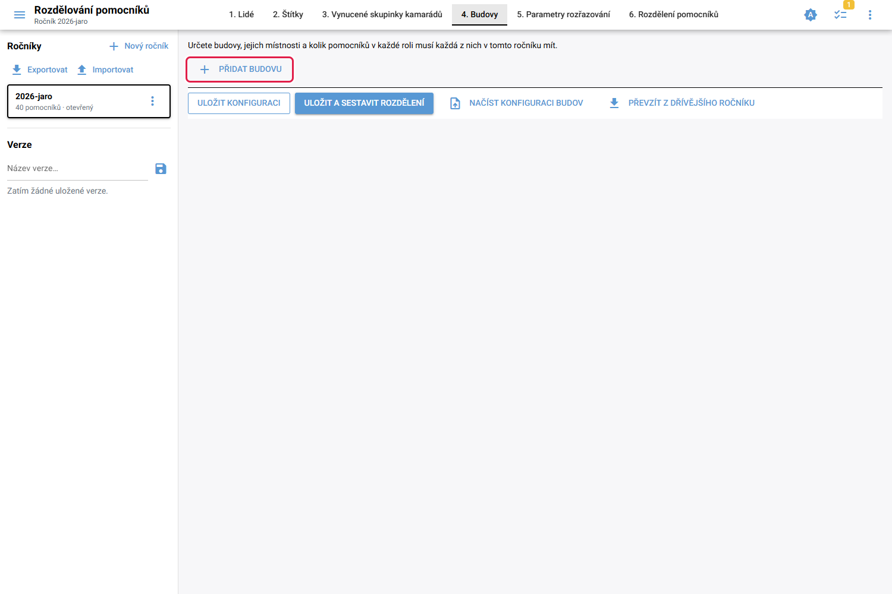

Klikněte na **Přidat budovu** — jednou za každou budovu. Tlačítka dole
(**Uložit konfiguraci**, **Načíst konfiguraci budov**, **Převzít z dřívějšího
ročníku**) vysvětlíme za chvíli.

U každé budovy:

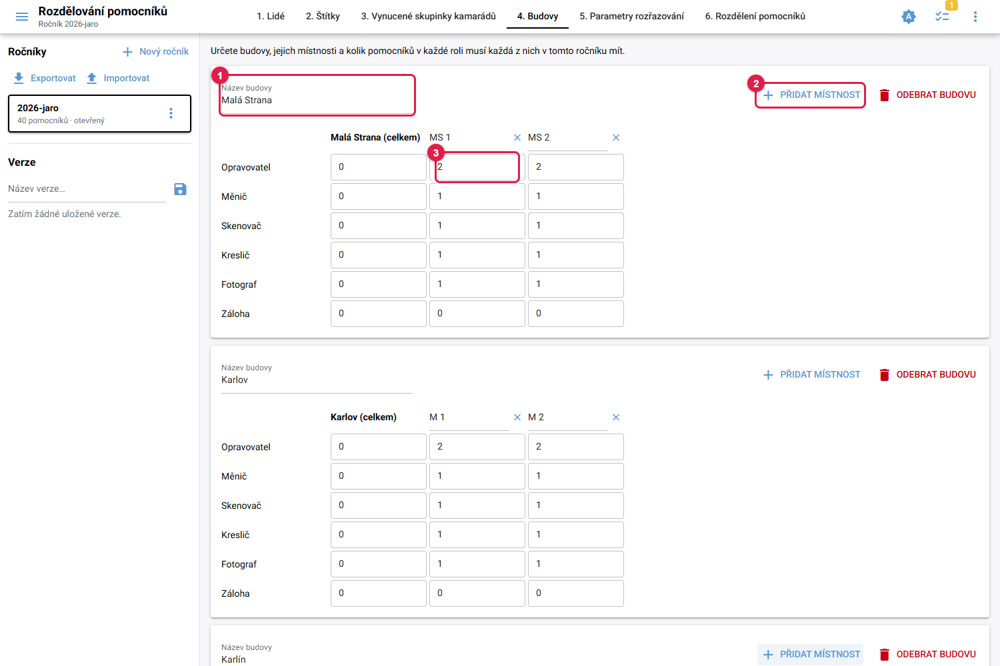

1. Napište **název budovy**. Pište ho tak, jak ho psali pomocníci
   (například `Karlov`), aby ho aplikace poznala.
2. Klikněte na **Přidat místnost** a přidejte všechny místnosti. Jejich
   názvy přepište přímo v záhlaví tabulky.
3. Do tabulky napište, **kolik lidí v jaké roli** musí být v místnosti
   (například 2 opravovatelé, 1 měnič…). Sloupec *celkem* je pro počty
   za celou budovu, když nezáleží na místnosti.

Až máte vše vyplněné, klikněte dole na **Uložit konfiguraci**.

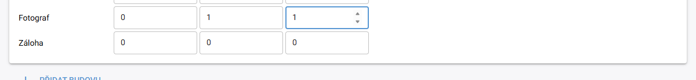

1. **Uložit konfiguraci** — uloží budovy, nic dalšího se nestane.
2. **Uložit a sestavit rozdělení** — uloží a rovnou spustí výpočet ([krok 6](#8-krok-6-sestavte-rozdělení)).

Žlutá nálepka **Neuložené změny** znamená, že jste ještě neuložili.

**Zkratky, které ušetří práci:**

- **Převzít z dřívějšího ročníku** — zkopíruje budovy, místnosti i počty
  z minulého ročníku. Tohle bývá nejrychlejší.
- **Načíst konfiguraci budov** — načte hotovou tabulku „Pomocníci v místnostech“
  (`.xlsx`). Barevné buňky znamenají jednoho pomocníka, šedé a prázdné nikoho.

### Budovy z dotazníku bez shody

Pomocníci vybírali budovy ve formuláři. Pokud nějaká budova z formuláře nemá
u vás odpovídající budovu, ozve se aplikace v panelu **K vyřízení**.

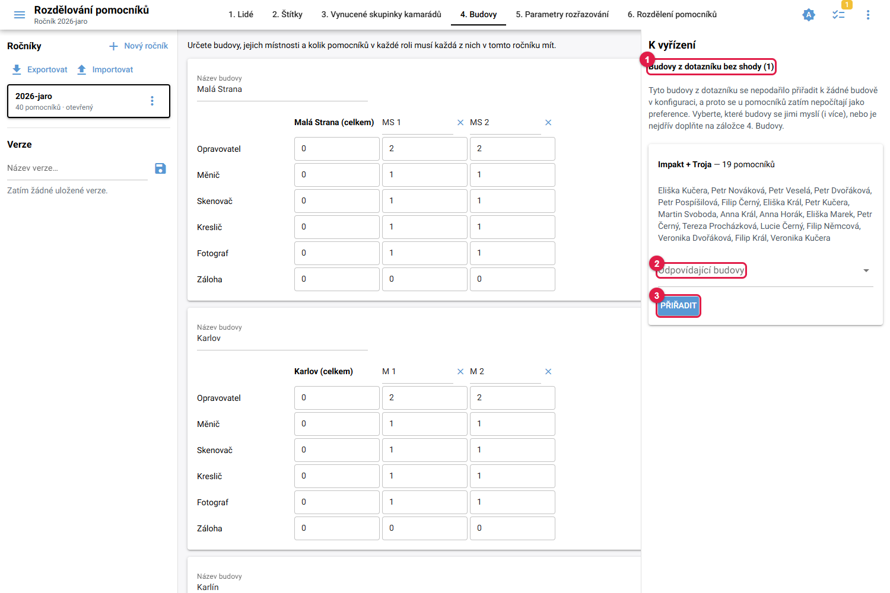

1. Nadpis **Budovy z dotazníku bez shody** — kolik takových názvů je.
2. **Odpovídající budovy** — vyberte, kterým vašim budovám tento název odpovídá.
3. **Přiřadit** — potvrdí.

Nebo se vraťte na záložku **4. Budovy** a chybějící budovu přidejte. V této
ukázce jsme budovu „Impakt + Troja“ přidat nechali záměrně, aby bylo vidět,
jak se aplikace ptá. Dokud ji nepřiřadíte, nepočítá se u těchto
pomocníků budova jako jejich přání.

## 7. Krok 5: Štítky, skupinky a parametry (nepovinné)

Tyhle tři záložky můžete **přeskočit**. Hodí se, až budete chtít něco
zvláštního.

**2. Štítky** — štítek je poznámka u člověka (třeba „zkušený“, „8.M“). Ke
štítku lze přidat pravidlo, například „kdo má tento štítek, musí být v budově
Karlov“. Nový štítek vytvoříte tlačítkem **Nový štítek**.

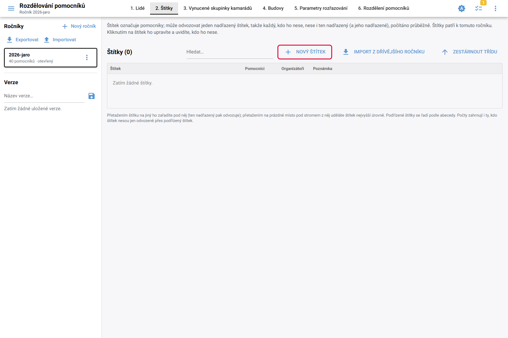

**3. Vynucené skupinky kamarádů** — skupinka lidí, kteří mají být **určitě**
spolu (například v jedné místnosti). Na rozdíl od přání kamaráda je to
pravidlo, které se hlídá. Vytvoříte ji tlačítkem **Nová skupinka**.

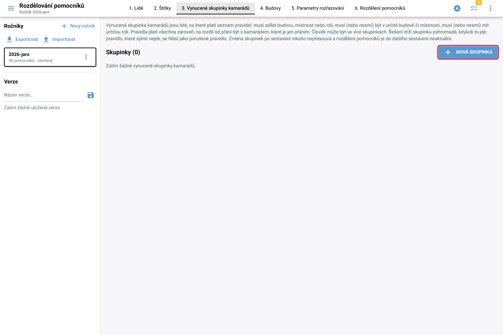

**5. Parametry rozřazování** — určují, co je pro počítač důležitější: přání
budovy, přání být s kamarádem, nebo přání role. Výchozí hodnoty jsou rozumné.
Měňte je jen tehdy, když výsledek nesedí. Nahoře je také **časový limit**
výpočtu (výchozí je 60 sekund).

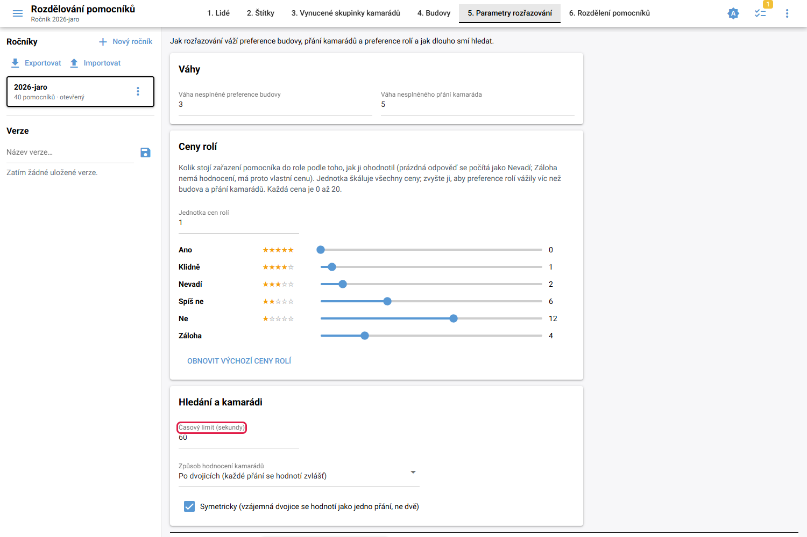

Nahoře u časového limitu hledání jsou vidět sekundy. Změny uložíte dole
tlačítkem **Uložit parametry**.

## 8. Krok 6: Sestavte rozdělení

Na záložce **4. Budovy** klikněte na **Uložit a sestavit rozdělení**. (Stejně
funguje tlačítko **Sestavit rozdělení** na záložce 6.)

Objeví se okno **Sestavuji rozdělení…**. Počítač hledá nejlepší rozdělení.
**Počkejte**, trvá to nejvýš tolik, kolik je časový limit (obvykle méně než
minutu). Okno nejde zavřít, zavře se samo.

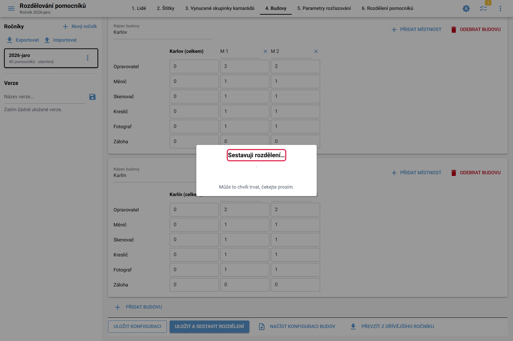

Když je hotovo, otevře se záložka **6. Rozdělení pomocníků**.

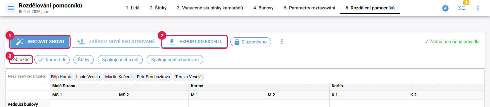

1. **Sestavit znovu** — spustí výpočet znovu.
2. **Export do Excelu** — uloží hotovou tabulku. Funguje, až je každý zařazen
   a rozdělení je aktuální.
3. **Zobrazení** — zapínání barevných pomůcek (viz [krok 7](#9-krok-7-upravte-rozdělení-ručně)).

Vpravo je buď zelené **✓ Žádná porušená pravidla**, nebo červené tlačítko
s počtem **porušených pravidel**. Na to se podívejte vždy — ukáže, co se
nepodařilo splnit (například chybí lidé v místnosti).

### Jak se čte tabulka

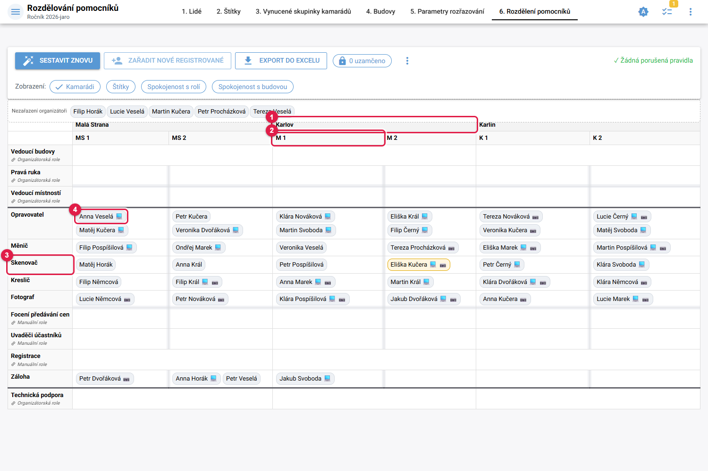

1. **Budova**.
2. **Místnost**.
3. **Role** (řádek). Nahoře jsou řádky pro organizátory, pod nimi řádky
   pro pomocníky: Opravovatel, Měnič, Skenovač, Kreslič, Fotograf a Záloha.
4. **Pomocník** — každé jméno je „kartička“. Ikona 💻 značí, že může přinést
   notebook, 📷 fotoaparát.

Oranžový rámeček kolem kartičky znamená, že pomocníkovo přání být s kamarádem
se nesplnilo.

## 9. Krok 7: Upravte rozdělení ručně

Výsledek je návrh. Cokoli v něm můžete změnit **přetažením myší**. Nic se
nepíše klávesnicí — jména se přenášejí kartičkami.

### Přesunutí pomocníka

Pomocníci, kteří ještě nikde nejsou, čekají nahoře v oblasti **Nezařazení**.
Typicky je to někdo, koho jste přidali ručně po sestavení rozdělení.

Pozdní zájemce přidáte na záložce **1. Lidé** tlačítkem **Přidat** nad
tabulkou *Pomocníci*:

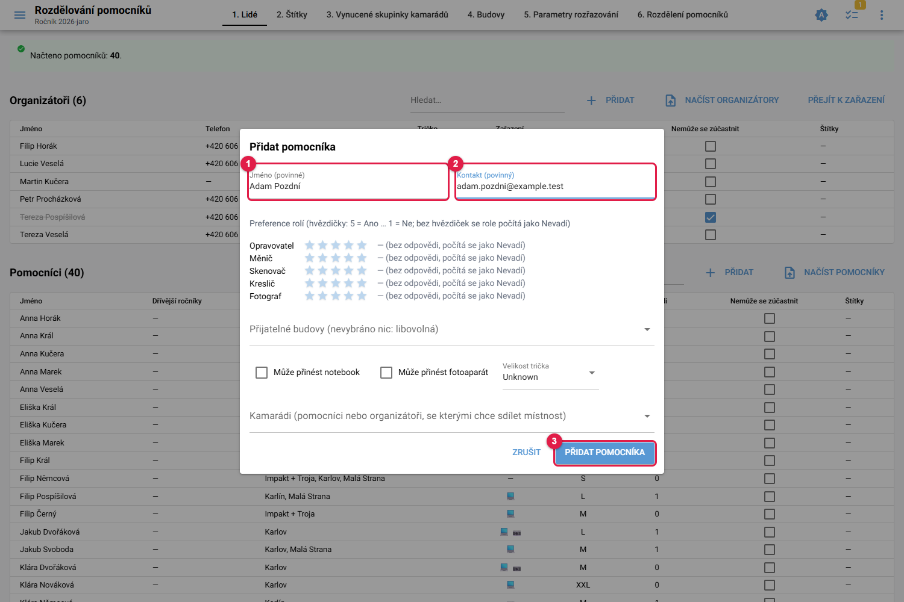

1. Jméno.
2. Kontakt (e-mail nebo telefon).
3. **Přidat pomocníka**.

Po návratu na záložku **6** vidíte upozornění, že někdo není zařazen.
Máte dvě možnosti:

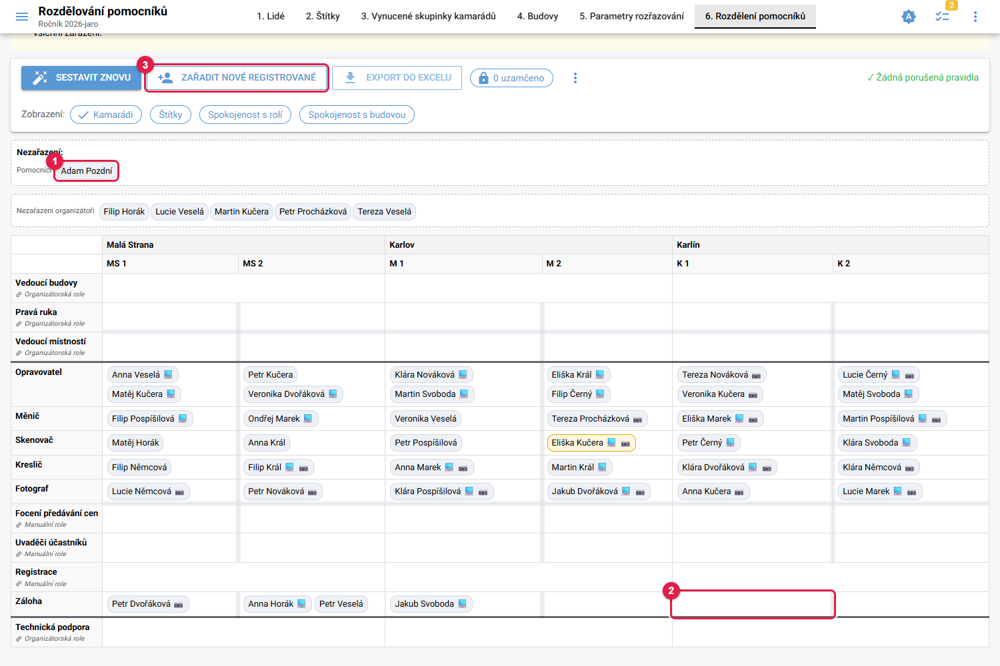

1. Kartička v oblasti **Nezařazení**. Chytněte ji myší…
2. …a **pusťte ji na buňku**, kam patří (správná místnost a role).
3. Nebo klikněte na **Zařadit nové registrované** — počítač nové lidi
   zařadí sám a **všichni ostatní zůstanou přesně na místě**.

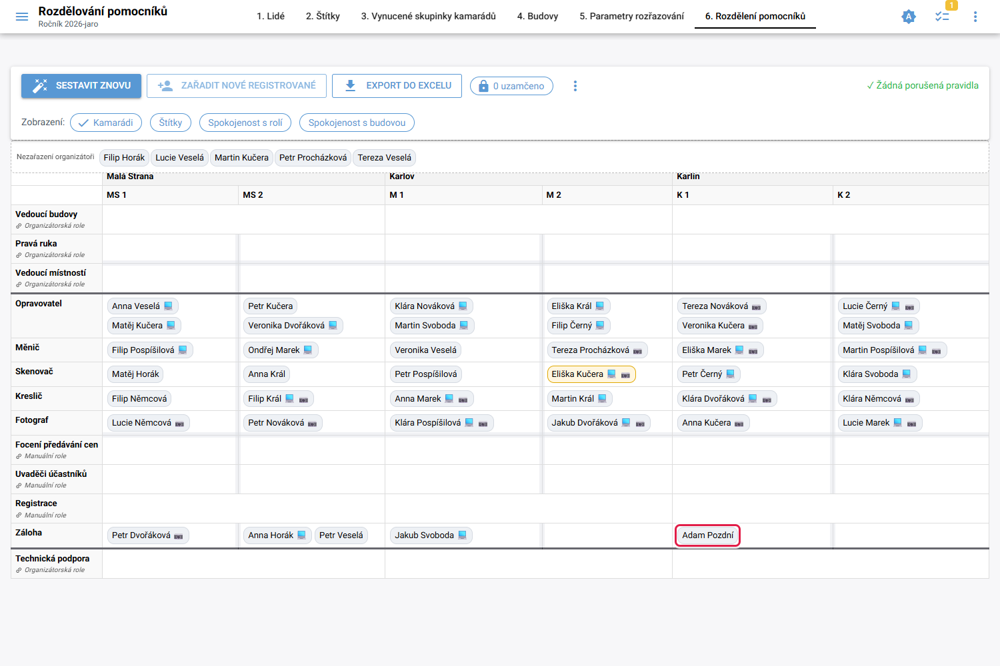

Takhle přesouvat můžete kohokoli — i z jedné buňky do druhé.

### Podrobnosti o pomocníkovi a zámek

Klikněte na kartičku. Otevře se **karta** s přáními pomocníka.

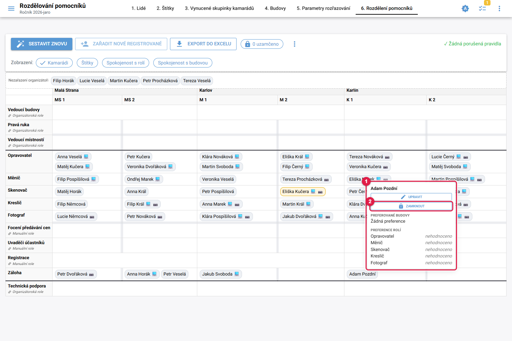

1. Karta ukazuje preferované budovy a hodnocení rolí.
2. **Zamknout** — zamčený pomocník **zůstane na svém místě**, i když pustíte
   **Sestavit znovu**. Zamčené poznáte podle 🔒. Odemkne ho totéž tlačítko.

Kartu zavřete klávesou **Esc** nebo kliknutím mimo ni. Podržíte-li při
kliknutí na kartičku **Ctrl**, zamkne se přímo.

> Pozor: **Sestavit znovu** přeskládá všechny, kdo nejsou zamčení. Aplikace
> se předem zeptá („Nahradit neuzamčená přiřazení?“). Chcete-li si ruční
> úpravy ponechat, zamkněte je. V nabídce ⋮ vedle tlačítek je
> **Uzamknout všechny zařazené**.

### Barevné pomůcky (Zobrazení)

Pod tlačítky jsou přepínače **Zobrazení**. Obarví kartičky podle toho,
jak jsou pomocníci spokojení.

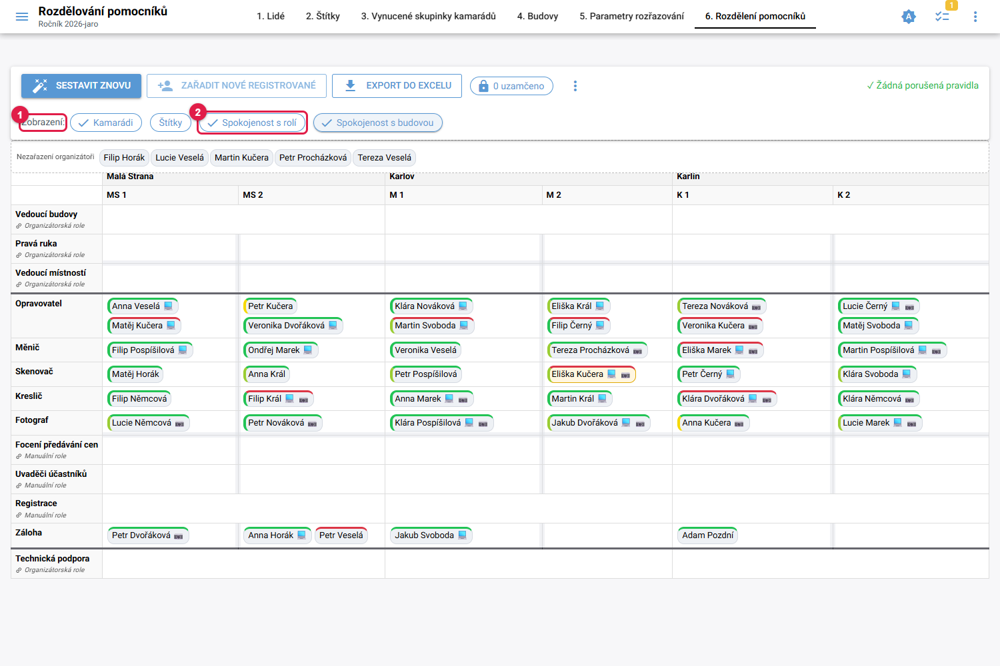

1. Nápis **Zobrazení**.
2. Přepínače:
   - **Kamárádi** — zvýrazní přání být s kamarádem (po najetí myší na
     kartičku se ukážou i kamarádi).
   - **Štítky** — pruhy podle štítků; umožní i **Filtrovat podle štítků**.
   - **Spokojenost s rolí** — svislý okraj vlevo: **zelený** = role mu vyhovuje,
     **červený** = spíš ne.
   - **Spokojenost s budovou** — vodorovný okraj nahoře: **zelený** = je v budově,
     kterou si přál, **červený** = není.

### Organizátoři

Organizátoři čekají v oblasti **Nezařazení organizátoři**. Přetáhněte je na
řádky **Vedoucí budovy**, **Pravá ruka**, **Vedoucí místností** nebo
**Technická podpora**. Jinam (do řádků pomocníků) nejdou.

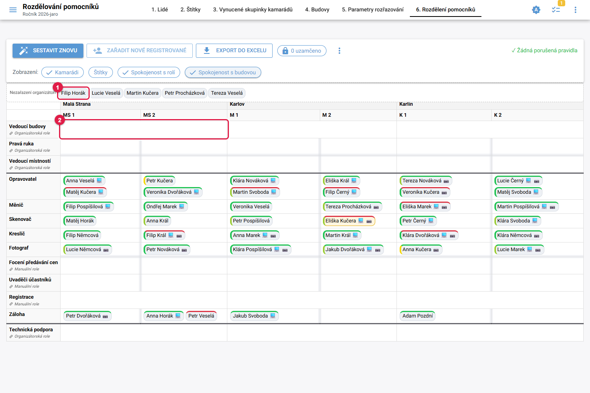

1. Organizátor v oblasti **Nezařazení organizátoři**.
2. Buňka, na kterou ho pustíte (zde Vedoucí budovy v budově Malá Strana).

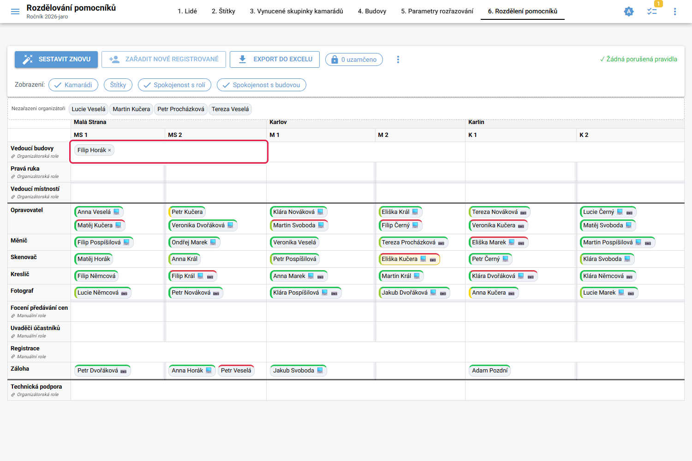

Z buňky ho odeberete **křížkem ×** vedle jména. Do buňky lze dát i víc lidí.

Řádky **Focení předávání cen**, **Uvaděči účastníků** a **Registrace** se
vyplňují jinak: přetáhněte na ně kartičku pomocníka z jeho místnosti.
Pomocník tím **zůstane na svém místě** a navíc se objeví i tady (s tečkovaným
okrajem). Registrace platí pro celou budovu, ostatní dvě pro konkrétní místnost.

## 10. Krok 8: Uložte verzi a exportujte do Excelu

### Verze

Před větším zásahem si můžete stav **uložit jako verzi** a později se k němu
vrátit. V postranním panelu napište název do pole **Název verze…** a stiskněte
Enter (nebo klikněte na disketu).

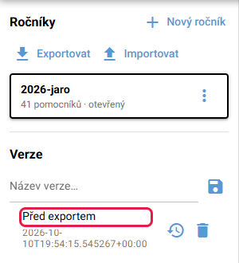

Uložená verze je v rámečku. Vpravo jsou dvě tlačítka: **Obnovit** (vrátí vše
do stavu té verze) a **Smazat**.

### Export

Až je rozdělení hotové, klikněte na **Export do Excelu**.

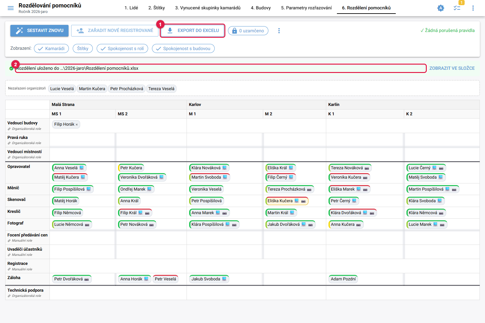

1. Tlačítko **Export do Excelu**.
2. Zelená zpráva ukáže, **kam se soubor uložil** — do složky tohoto ročníku.
   Vpravo je tlačítko **Zobrazit ve složce**, které složku otevře.

Při dalším exportu se starý soubor **přepíše**. Chcete-li si ho uschovat,
přejmenujte ho nebo zkopírujte jinam. Pokud je soubor otevřený v Excelu,
export nepůjde — zavřete ho.

## 11. Když něco nejde

**Tlačítko Export do Excelu je šedé.**
Najeďte na ně myší, napíše důvod. Obvykle jde o jedno z těchto:

- *Rozdělení pomocníků je neaktuální.* Něco jste změnili (například někomu
  zaškrtli *Nemůže se zúčastnit*). Klikněte na **Sestavit znovu**.
- *Zatím nezařazení zájemci.* Někdo nemá místo. Přetáhněte ho do tabulky
  nebo klikněte na **Zařadit nové registrované**.
- Ještě jste nic nesestavili — udělejte [krok 6](#8-krok-6-sestavte-rozdělení).

**Červené tlačítko „porušená pravidla“.**
Klikněte na něj. Každý řádek říká, co se nepodařilo splnit, a tlačítko
**Opravit** vás zavede tam, kde to jde napravit. Typicky se do místnosti
nedostal dost lidí, nebo někdo porušuje pravidlo štítku či skupinky.

**Sestavení hlásí, že nenašlo rozdělení.**
Zkuste prodloužit časový limit na záložce **5. Parametry rozřazování**.
Zkontrolujte také, že počty lidí v budovách na záložce **4** nejsou vyšší,
než kolik máte pomocníků.

**Nahrál jsem špatný soubor / chci začít znovu.**
Vpravo nahoře je nabídka ⋮ s položkou **Začít znovu**. Otevřený ročník se
vyprázdní. Uložené verze zůstanou. Předtím můžete ročník vyexportovat
(v postranním panelu **Exportovat**) a mít jeho zálohu v souboru `.zip`.

**Aplikace přestala reagovat.**
Zavřete prohlížeč i okno programu, spusťte `rostering.exe` znovu a otevřete
<http://127.0.0.1:8000>. Data se ukládají samy, nic neztratíte.

**Chci přenést data na jiný počítač.**
V postranním panelu u **Ročníky** klikněte na **Exportovat**, na druhém počítači
na **Importovat**.

---

## Pro vývojáře: jak se obrázky vytvářejí

Obrázky v `img/` vzniknou skriptem
[`tools/make_screenshots.py`](tools/make_screenshots.py). Skript spustí aplikaci
nad vymyšlenými daty z `tests/survey_factory.py` (do dočasné složky, skutečná
`data/` se nedotkne), proklikává ji přes Playwright a červené rámečky kreslí
těsně před každým snímkem. Po změně vzhledu aplikace je stačí vygenerovat znovu:

```
pip install playwright          # do virtuálního prostředí projektu
python docs/manual/tools/make_screenshots.py
```

Skript používá prohlížeč Microsoft Edge (`PLAYWRIGHT_CHANNEL` lze změnit na
`chrome` nebo `chromium`).
